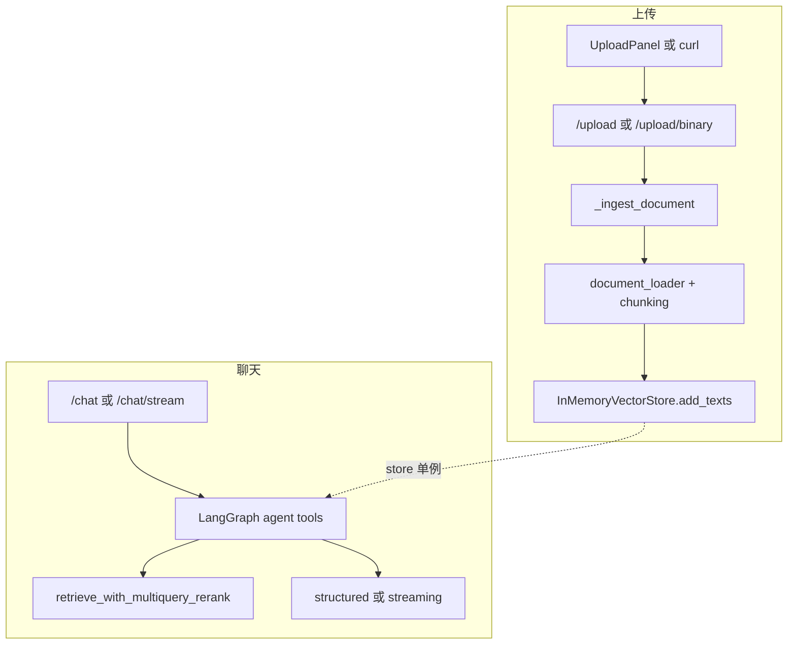

# knowledge-base-demo：架构与实现（结合目录与源码的分步说明）

本文在「**目标 → 目录 → 按实现顺序拆解**」三个层次上说明本项目是如何搭起来的；文中引用源码时采用 **`起始行:结束行:文件路径`** 格式，便于在 IDE 中跳转。

---

## 导读：项目到底在解决什么问题？

1. **用户上传** Word / PDF / 文本 → 系统解析成纯文本 → **切成 chunk** → **向量化** → 放进**进程内向量库**。  
2. **用户提问** → **LangGraph Agent** 根据系统提示决定要不要调用工具 **`search_docs`** → 工具内部走 **Multi-Query + 向量召回 + LLM Rerank** → 把摘录塞回对话 → 模型生成最终回答。  
3. **对外**：FastAPI 提供 **上传**、**同步 JSON 聊天**、**SSE 流式聊天**；React 页面负责选文件、发消息、解析流。

下面按「**实现顺序**」走读代码（与「依赖 import 顺序」大致一致，但更偏产品逻辑）。

---

## 第零步：仓库全景（目录与文件职责）

仓库根目录：

| 路径 | 作用 |
|------|------|
| `Makefile` | `install` / `dev-backend` / `dev-frontend`；`upload-api`、`upload-binary-api` 示例 curl |
| `ARCHITECTURE.md` | 本说明文档 |
| `backend/` | Python 后端：FastAPI + RAG + Agent |
| `frontend/` | Vite + React + TS 前端 |

### `backend/`（仅业务源码，不含 `.venv`）

```
backend/
├── requirements.txt          # Python 依赖锁版本区间
├── .env / .env.example       # 运行时密钥与说明（.env 勿提交 git）
├── app/                      # HTTP 层：路由、依赖注入、与 HTTP 绑定的 Pydantic
│   ├── main.py               # FastAPI 实例、CORS、/health、/upload*、/chat*
│   ├── deps.py               # get_vector_store、get_chat_model（单例）
│   └── schemas_http.py       # ChatRequest（body.message）
├── kb_rag/                   # RAG 领域逻辑（包名刻意不用 `rag`，避免与 PyPI 包冲突）
│   ├── __init__.py           # 对外 re-export 常用符号
│   ├── document_loader.py    # 按扩展名/魔数 → 纯文本
│   ├── docx_parser.py        # python-docx 解析 .docx
│   ├── pdf_parser.py         # pypdf 解析 .pdf
│   ├── chunking.py           # 段落级语义分块
│   ├── embeddings.py         # SentenceTransformer + 无 torch 时的 HashEmbedding
│   ├── vector_store.py       # InMemoryVectorStore（余弦 ≈ 归一化点积）
│   ├── multi_query.py        # LLM 生成多条检索 query
│   ├── rerank.py             # LLM 对候选 passage 打分重排
│   ├── retrieval.py          # multi-query + 合并 + rerank 串联
│   └── llm.py                # ChatOpenAI 工厂（DeepSeek / OpenAI 兼容）
├── agent/                    # LangGraph 编排与对话后处理
│   ├── __init__.py           # 导出 build_rag_agent_graph、run_rag_…、stream_rag_… 等
│   ├── graph.py              # StateGraph：agent ⟷ ToolNode 循环
│   ├── tools.py              # search_docs 工具（闭包绑定 store + llm）
│   ├── pipeline.py           # Graph → 结构化答案（给 /chat）
│   ├── structured.py         # 对话转写、with_structured_output、重试
│   └── streaming.py          # Graph → 流式 Markdown + metadata（给 /chat/stream）
└── schemas/                  # 业务 Pydantic（与 HTTP schemas 区分）
    ├── rag_answer.py         # RAGStructuredAnswer
    └── rag_metadata.py       # 元数据抽取用模型（若存在）
```

### `frontend/src/`

```
frontend/src/
├── main.tsx              # ReactDOM createRoot
├── App.tsx               # 根组件，直接渲染 HomePage
├── pages/HomePage.tsx    # 上传区 + 聊天区 + SSE 消费
├── components/
│   ├── UploadPanel.tsx   # 上传：默认 POST /upload/binary
│   └── MessageBubble.tsx # 单条消息展示
├── api/client.ts         # getApiBase()、fetchHealth()
└── lib/sse.ts            # 解析 SSE 的 data: JSON 行
```

---

## 第一步：让 Python 找到「本仓库的模块」——`sys.path` 与 `load_dotenv`

运行命令一般是：在 `backend/` 下执行 `uvicorn app.main:app`。此时默认 `sys.path` 未必包含 **`backend` 根目录**，若环境里又装了同名包 `rag`，会 **import 错包**。因此在 `app/main.py` **最前面**把 `backend` 根插进 `sys.path`：

```13:17:backend/app/main.py
# 确保优先加载「本仓库 backend/」下的 kb_rag/agent，避免 sys.path 顺序导致加载到错误目录
_BACKEND_ROOT = Path(__file__).resolve().parent.parent
_backend_root_str = str(_BACKEND_ROOT)
if _backend_root_str not in sys.path:
    sys.path.insert(0, _backend_root_str)
```

紧接着加载 **`.env`**，且 **`override=True`**：避免 shell 里已有「空的 `OPENAI_API_KEY`」导致 `.env` 里的 DeepSeek Key 无法注入（典型 401 原因之一）。

```21:23:backend/app/main.py
# 必须在 import agent / kb_rag 之前加载，否则部分依赖在 import 时读不到 Key
# override=True：避免 shell 里已存在空 OPENAI_API_KEY 时 .env 里的 DeepSeek Key 无法注入导致 401
load_dotenv(_BACKEND_ROOT / ".env", override=True)
```

**小结**：这一步解决的是 **「模块从哪来」** 和 **「密钥从哪来」**，后面所有 `from kb_rag …`、`from agent …` 都依赖它。

---

## 第二步：创建 FastAPI 应用并挂中间件、路由

`FastAPI()` 实例在 `main.py` 中创建；CORS 放行本地 Vite 源，便于浏览器 `5173` 调 `8000`（或通过代理同域调 `/api`）。

```40:40:backend/app/main.py
app = FastAPI(title="LangGraph RAG Demo", version="0.1.0")
```

```106:115:backend/app/main.py
app.add_middleware(
    CORSMiddleware,
    allow_origins=[
        "http://localhost:5173",
        "http://127.0.0.1:5173",
    ],
    ...
)
```

具体路由在 **第十一步** 汇总；中间穿插的 `_ingest_document`、`_merge_description_into_plain` 属于 **上传编排**，在 **第五步** 与 `kb_rag` 一起读更顺。

---

## 第三步：依赖注入单例——`app/deps.py`

HTTP 层不希望在每个请求里重新加载 **embedding 模型** 或 **Chat 模型**，因此用 **进程级单例**：

```16:27:backend/app/deps.py
def get_vector_store() -> InMemoryVectorStore:
    ...
    if _vector_store is None:
        _vector_store = InMemoryVectorStore()
    return _vector_store


@lru_cache(maxsize=1)
def get_chat_model() -> BaseChatModel:
    """返回进程内缓存的 Chat 模型（用于 Agent / 结构化 / 流式）。"""
    return create_rag_chat_model()
```

- **`InMemoryVectorStore`**：内存向量库，重启即丢数据，适合 demo。  
- **`@lru_cache`**：第一次 `Depends(get_chat_model)` 时创建 `ChatOpenAI`；**改 `.env` 后必须重启 uvicorn**，否则仍是旧客户端。

---

## 第四步：LLM 客户端工厂——`kb_rag/llm.py`

所有需要调用大模型的地方（multi-query、rerank、Agent、结构化）共用一个 **`ChatOpenAI`** 配置。这里完成：

1. **`OPENAI_BASE_URL` / `OPENAI_API_BASE`** 解析为兼容网关 Base（如 DeepSeek）。  
2. **`DEEPSEEK_API_KEY` → `OPENAI_API_KEY`** 等别名回填。  
3. 仅配置了 **`DEEPSEEK_API_KEY`** 且未写 Base 时，默认 **`https://api.deepseek.com/v1`**。  
4. **`api_key=`** 显式传入构造函数，减少「环境变量未传到 SDK」的偶发问题。

核心逻辑见 `create_rag_chat_model`（节选）：

```67:90:backend/kb_rag/llm.py
def create_rag_chat_model(**kwargs: Any) -> ChatOpenAI:
    ...
    _ensure_openai_api_key_from_aliases()
    merged: dict[str, Any] = {"temperature": 0}
    merged.update(kwargs)
    base = _resolve_openai_compatible_base_url()
    if not base and (os.environ.get("DEEPSEEK_API_KEY") or "").strip():
        base = "https://api.deepseek.com/v1"
    if base and merged.get("base_url") is None and merged.get("openai_api_base") is None:
        merged["base_url"] = base.rstrip("/")
    if "model" not in merged:
        merged["model"] = _default_chat_model_for_env(resolved_base=base)
    api_key = (os.environ.get("OPENAI_API_KEY") or "").strip()
    if api_key and merged.get("api_key") is None:
        merged["api_key"] = api_key
    return ChatOpenAI(**merged)
```

**小结**：这一步把「**连哪家模型服务**」集中配置好，上层只拿 `BaseChatModel` 用。

---

## 第五步：文档 → 纯文本 → 分块 → 入库编排

### 5.1 上传 API 与 `_ingest_document`（`app/main.py`）

上传有两条路：

- **`POST /upload`**：`multipart/form-data`，用 **`await request.form()`** 取 `file` / `upload` 与可选 `description`（避免 `File`+`Form` 声明在部分客户端下读体异常）。  
- **`POST /upload/binary`**：原始 body = 文件字节，**`filename` 查询参数**带扩展名；前端 `UploadPanel` 默认走此路。

真正「解析 + 分块 + 入库」集中在 **`_ingest_document`**，顺序非常重要：

1. 拒绝空字节。  
2. **`bytes_to_plain_text`** → **`chunk_plain_text`** → 过滤空串。  
3. **若没有可入库 chunk，直接 400，且此时尚未 `clear`**（避免 `replace=true` 先清空再发现 0 条）。  
4. 通过校验后再 `replace` 时 `store.clear()`，然后 **`store.add_texts(texts)`**。

```53:104:backend/app/main.py
async def _ingest_document(
    *,
    filename: str,
    data: bytes,
    description: str | None,
    replace: bool,
    store: InMemoryVectorStore,
) -> dict:
    ...
    plain = _document_loader.bytes_to_plain_text(filename=filename, data=data)
    plain = _merge_description_into_plain(plain=plain, description=desc_stripped)
    chunks = chunk_plain_text(plain)
    texts = [t.strip() for t in chunks if t and t.strip()]
    ...
    if replace:
        store.clear()
    ids = store.add_texts(texts)
```

`_merge_description_into_plain` 把可选说明前缀拼进正文，缓解「扫描 PDF 无字」场景。

### 5.2 `kb_rag/document_loader.py`

按扩展名选择解析器；`.pdf` 或 `%PDF` 魔数走 `pdf_parser`；`.docx` 走 `docx_parser`；文本类 UTF-8 解码。解析失败会抛出 **`UnsupportedDocumentError`**，在 `_ingest_document` 中转成 HTTP 400。

### 5.3 `kb_rag/chunking.py`

在纯文本上做「段落优先 + 长度控制 + 过长硬切」等策略，输出 **`list[str]`** chunk，供向量库批量编码。

---

## 第六步：嵌入与内存向量库——`kb_rag/embeddings.py` + `vector_store.py`

### 6.1 嵌入后端

- 若本机已安装 **torch + sentence-transformers**，使用 **`SentenceTransformerEmbedding`**（懒加载权重）。  
- 否则自动 **`HashEmbedding`**（仅 numpy，无语义质量，但能让 **上传 + 检索 API 跑通**）。

`create_default_embedder()` 在 `InMemoryVectorStore` 构造时使用。

### 6.2 `InMemoryVectorStore`

- **`add_texts`**：`encode` 得到 `(n, d)` 矩阵，行 L2 归一化；与已有矩阵 `vstack`。  
- **`similarity_search`**：查询向量与矩阵做 **`matrix @ q`**，分数即余弦相似度（归一化后点积）。

```67:123:backend/kb_rag/vector_store.py
    def add_texts(self, texts: list[str]) -> list[str]:
        ...
        new_vectors = self._embedder.encode(cleaned)
        ...
        scores = matrix @ q  # (n,)
        idx = _top_k_indices(scores, k)
```

**小结**：到这一步，「**知识库**」已经可以在代码里通过 `store.similarity_search(q, k)` 被检索。

---

## 第七步：检索增强管线——`multi_query` + `rerank` + `retrieval.py`

工具 **`search_docs`** 与内部检索都走 **`retrieve_with_multiquery_rerank`**，步骤在文件头注释写得很清楚：

```26:50:backend/kb_rag/retrieval.py
    """
    1) LLM 生成多查询；2) 各查询做 cosine 检索；3) 按 chunk_id 合并保留最高向量分；
    4) 截断为 max_candidates；5) LLM rerank 取 rerank_top_n。
    """
    queries = await generate_multi_queries(llm, question, max_alternates=max_alternates)
    ...
    order = await rerank_passages(
        llm,
        question=question,
        passages=passages,
        top_n=min(rerank_top_n, len(passages)),
    )
```

- **`multi_query`**：用结构化输出让模型生成多条改写 query，缓解「用户说法与向量空间不匹配」。  
- **`rerank`**：对合并后的候选段落让模型打分排序，缓解「向量近但语义不相关」。

---

## 第八步：LangGraph Agent——`agent/graph.py` + `agent/tools.py`

### 8.1 图结构（`graph.py`）

- **状态**：`MessagesState`（消息列表）。  
- **节点 `agent`**：`SystemMessage` + 历史 → **`llm.bind_tools([search_docs])`** → 返回 `AIMessage`（可能带 `tool_calls`）。  
- **节点 `tools`**：LangGraph 预置 **`ToolNode`**，按模型给出的 tool_calls 执行 Python 工具。  
- **路由**：若最后一条 `AIMessage` 含 `tool_calls` → 进 `tools`，否则 **`END`**；`tools` 执行完回到 `agent`，形成循环。

```35:71:backend/agent/graph.py
def build_rag_agent_graph(
    llm: BaseChatModel,
    store: InMemoryVectorStore,
    ...
):
    search_docs = build_search_docs_tool(store, llm)
    tools = [search_docs]
    llm_with_tools = llm.bind_tools(tools)
    tool_node = ToolNode(tools)
    ...
    workflow.add_conditional_edges(
        "agent",
        _route_after_agent,
        {"tools": "tools", END: END},
    )
    workflow.add_edge("tools", "agent")
    return workflow.compile()
```

### 8.2 工具（`tools.py`）

`search_docs` 是普通 Python 函数，用 **`@tool`** 装饰后交给模型 **function calling** 调度；内部 **async** 调检索管线，并把命中结果格式化成模型易读的文本块（含 `chunk_id`、分数、正文）。

```32:63:backend/agent/tools.py
    @tool
    async def search_docs(query: str) -> str:
        ...
        hits = await retrieve_with_multiquery_rerank(
            store,
            llm,
            q,
            ...
        )
```

### 8.3 AI Agent 数据处理流程（端到端）

从数据视角看，Agent 处理一次问题会经过下面 7 个阶段：

1. **入口入图**：`/chat` 或 `/chat/stream` 接收 `message`，构造 `HumanMessage` 放入 `MessagesState`。  
2. **Agent 首轮推理**：`agent` 节点把 `SystemMessage + 历史消息` 发给 `llm_with_tools`，得到 `AIMessage`（可能包含 `tool_calls`）。  
3. **是否检索路由**：`_route_after_agent` 判断最后一条 `AIMessage`；若无 `tool_calls` 直接 `END`，否则进入 `tools`。  
4. **工具检索执行**：`ToolNode` 调用 `search_docs(query)`，内部跑 `multi_query + 向量召回 + rerank`，返回拼装后的证据文本。  
5. **证据回灌状态**：工具返回作为 `ToolMessage` 追加到 `MessagesState`，图回到 `agent` 节点继续推理。  
6. **循环收敛**：重复「Agent 推理 ↔ Tools 执行」，直到模型不再发出 `tool_calls`。  
7. **出口消费**：  
   - `/chat`：将完整 `messages` 交给 `synthesize_structured_rag_answer`，产出 `answer/confidence/sources`。  
   - `/chat/stream`：先完整跑图，再基于 transcript 流式输出正文 token，最后单独产出 metadata。

```text
HTTP(/chat or /chat/stream)
  -> HumanMessage
  -> LangGraph(MessagesState)
       agent(llm_with_tools)
         -> no tool_calls -> END
         -> tool_calls    -> ToolNode(search_docs)
                              -> retrieval(multi_query + rerank)
                              -> ToolMessage
                              -> back to agent (loop)
  -> finalized messages
  -> sync: structured answer | stream: token events + metadata
```

这条流程的关键点是：**检索结果不是直接返回给用户，而是先作为对话证据回灌给模型**，由模型在最终回答阶段统一组织语言与引用。

**小结**：这一步把「**RAG 检索**」从应用层 `if query:` 里解放出来，交给 **模型 + 图** 决定何时检索、检索几次。

---

## 第九步：对话结束后的「结构化契约」——`pipeline.py` + `structured.py` + `schemas/`

### 9.1 同步路径（`/chat`）

`run_rag_conversation_to_structured`：**先跑完整 Graph**，再把 **`state["messages"]`** 交给 **`synthesize_structured_rag_answer`**，得到 **`RAGStructuredAnswer`**（Pydantic）。

```19:39:backend/agent/pipeline.py
async def run_rag_conversation_to_structured(
    llm: BaseChatModel,
    store: InMemoryVectorStore,
    user_message: str,
    ...
):
    graph = build_rag_agent_graph(llm, store)
    state = await graph.ainvoke(
        {"messages": [HumanMessage(content=user_message)]},
        config={"recursion_limit": recursion_limit},
    )
    return await synthesize_structured_rag_answer(
        llm,
        messages=state["messages"],
        max_retries=max_structured_retries,
    )
```

### 9.2 `structured.py`

- **`render_messages_transcript`**：把多轮消息（含 tool_calls）压成一段可读文本。  
- **`synthesize_structured_rag_answer`**：`llm.with_structured_output(RAGStructuredAnswer)` + 业务校验失败则 **追加纠错 HumanMessage 重试**。

### 9.3 `schemas/rag_answer.py`

对外 JSON 契约字段：`answer`、`confidence`、`sources`，带 validator 做类型/范围清洗。

```14:31:backend/schemas/rag_answer.py
class RAGStructuredAnswer(BaseModel):
    answer: str = Field(...)
    confidence: float = Field(..., ge=0.0, le=1.0)
    sources: list[str] = Field(default_factory=list, ...)
```

---

## 第十步：SSE 流式——`agent/streaming.py`

流式接口 **不是**「边 Graph 边流 token」，而是：

1. **先完整跑 Graph**（与同步一致，保证工具与上下文闭合）。  
2. 用转写 **`transcript`** 再开 **`llm.astream`**，只流式输出「面向用户的 Markdown 正文」。  
3. 流结束后调用 **`synthesize_metadata_only`** 生成 `confidence` / `sources`。  
4. 通过 **`_sse_data`** 产出 `data: {...}\n\n` 行；异常走 **`_friendly_stream_error`**。

```94:149:backend/agent/streaming.py
        graph = build_rag_agent_graph(llm, store)
        state = await graph.ainvoke(...)
        messages: list[BaseMessage] = state["messages"]
        transcript = render_messages_transcript(messages)
        ...
        async for chunk in llm.astream(stream_messages):
            ...
            yield _sse_data({"type": "token", "content": delta})
        ...
        meta = await synthesize_metadata_only(...)
        yield _sse_data({"type": "metadata", "confidence": meta.confidence, "sources": meta.sources})
        yield _sse_data({"type": "done"})
```

**设计取舍**：优先 **正确性**（先跑完 Agent），牺牲「首 token 更早」；适合教学 demo 与排错。

---

## 第十一步：HTTP 路由汇总——`app/main.py` 后半

| 方法 | 路径 | 作用 |
|------|------|------|
| GET | `/health` | 状态、`document_loader_file`、`embedding_backend`、Key/Base 是否配置（布尔） |
| POST | `/upload` | multipart 上传 |
| POST | `/upload/binary` | 原始 body 上传 |
| POST | `/chat` | JSON body：`ChatRequest.message` → 同步结构化 JSON |
| POST | `/chat/stream` | 同上 → SSE |

`ChatRequest` 定义在 **`app/schemas_http.py`**，与业务 **`schemas/rag_answer.py`** 刻意分离。

```10:13:backend/app/schemas_http.py
class ChatRequest(BaseModel):
    message: str = Field(min_length=1, description="用户问题")
```

`/chat/stream` 返回 **`StreamingResponse`**，`media_type=text/event-stream`（见 `main.py` 约 229–252 行）。

---

## 第十二步：前端——代理、页面、SSE 解析

### 12.1 Vite 代理（`frontend/vite.config.ts`）

浏览器访问 **`/api/*`** 时，Vite 开发服务器转发到 **`http://127.0.0.1:8000`**，并把路径前缀 **`/api` 去掉**，这样前端请求 **`/api/health`** 实际打到后端 **`/health`**。

```11:19:frontend/vite.config.ts
    proxy: {
      "/api": {
        target: "http://127.0.0.1:8000",
        changeOrigin: true,
        rewrite: (path) => path.replace(/^\/api/, ""),
        timeout: 300_000,
        proxyTimeout: 300_000,
      },
    },
```

### 12.2 `getApiBase()`（`frontend/src/api/client.ts`）

默认 **`/api`**；若部署时前后端分离，可设 **`VITE_API_BASE`** 为完整后端 origin。

### 12.3 上传（`UploadPanel.tsx`）

使用 **`fetch(url, { method: "POST", body: await file.arrayBuffer() })`** 调 **`/upload/binary`**，查询串包含 **`filename`** 与 **`replace`**；**不要**手写 multipart 的 `Content-Type`（会丢 boundary）。

### 12.4 聊天与 SSE（`HomePage.tsx` + `lib/sse.ts`）

- **`POST /chat/stream`**：`Content-Type: application/json`，body 为 **`{ message }`**。  
- 使用 **`ReadableStreamDefaultReader`** 读字节，拼到缓冲区，交给 **`parseSseDataLines`** 按 `\n\n` 切帧，解析 `data:` 后 JSON。  
- 根据 `type` 为 **`token` / `metadata` / `error` / `done`** 更新 React state。

```111:137:frontend/src/pages/HomePage.tsx
      const res = await fetch(`${getApiBase()}/chat/stream`, {
        method: "POST",
        headers: { "Content-Type": "application/json" },
        body: JSON.stringify({ message: userText }),
        signal: controller.signal,
      });
      ...
        const parsed = parseSseDataLines(sseBuf);
        sseBuf = parsed.rest;
        applyEvents(parsed.events);
```

`parseSseDataLines` 见 **`frontend/src/lib/sse.ts`**（支持半包拼接）。

### 12.5 应用入口

- **`main.tsx`**：挂载根。  
- **`App.tsx`**：只渲染 **`HomePage`**（演示级应用，无路由框架）。

---

## 第十三步：Makefile 与本地联调

根目录 **`Makefile`**：

- **`make install-backend`**：创建 `.venv` 并 `pip install -r requirements.txt`。  
- **`make dev-backend`**：`PYTHONPATH=. uvicorn app.main:app --reload --port 8000`。  
- **`make dev-frontend`**：`npm run dev`（Vite 5173）。  
- **`make upload-api` / `make upload-binary-api`**：示例 curl（需本机已起前后端）。

---

## 附录 A：端到端数据流（总图）



---

## 附录 B：已知边界（读源码时心里要有数）

- 向量库 **纯内存**，重启清空。  
- **扫描 PDF** 可能无文本，可依赖 **`description`** 或换源文件。  
- **`get_chat_model` 缓存**：改 `.env` 必须重启后端。  
- 生产需鉴权、持久化向量库、观测与限流等，本仓库为 **demo 范围**。

---

## 附录 C：与第一版短文档的关系

上文在保留「目标 / 技术栈 / 总图」的基础上，按 **实现顺序** 把 **目录 → 关键文件 → 关键代码段** 串成一条可读路径；若你只想要一页纸摘要，可只看上文 **「导读」「第零步」「附录 A」** 三节。
